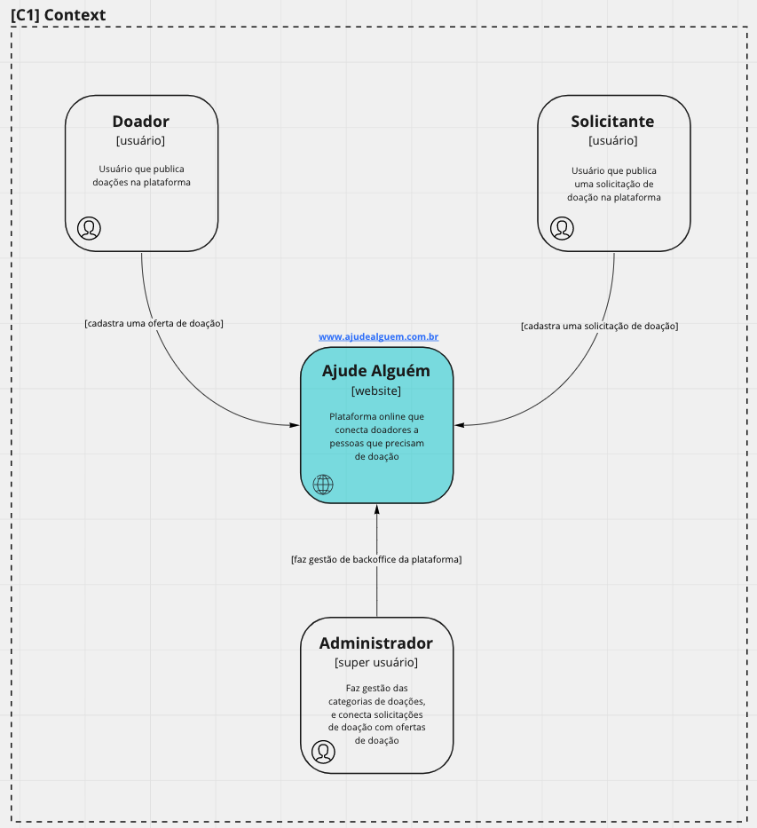
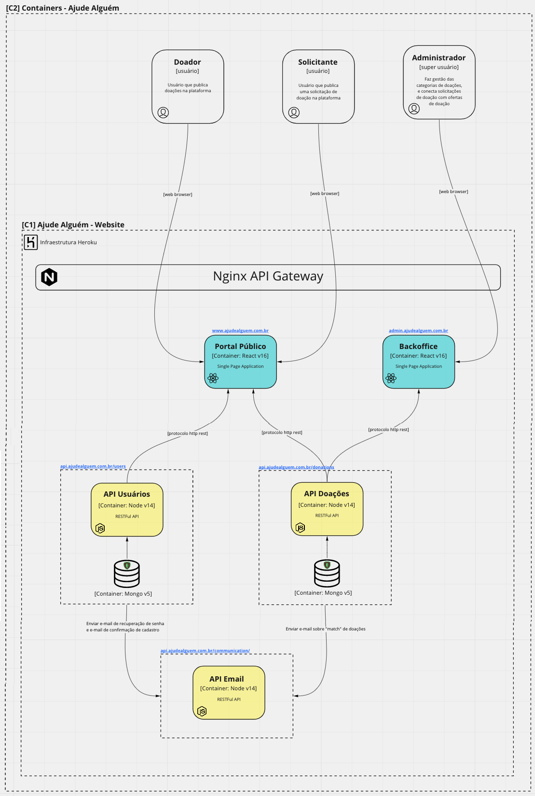
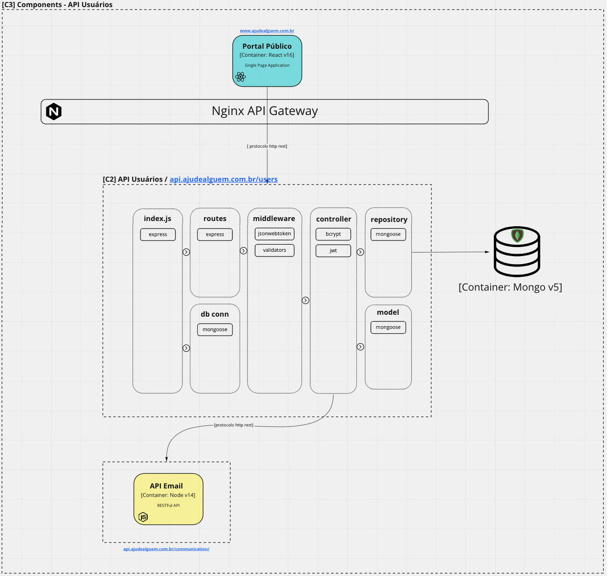
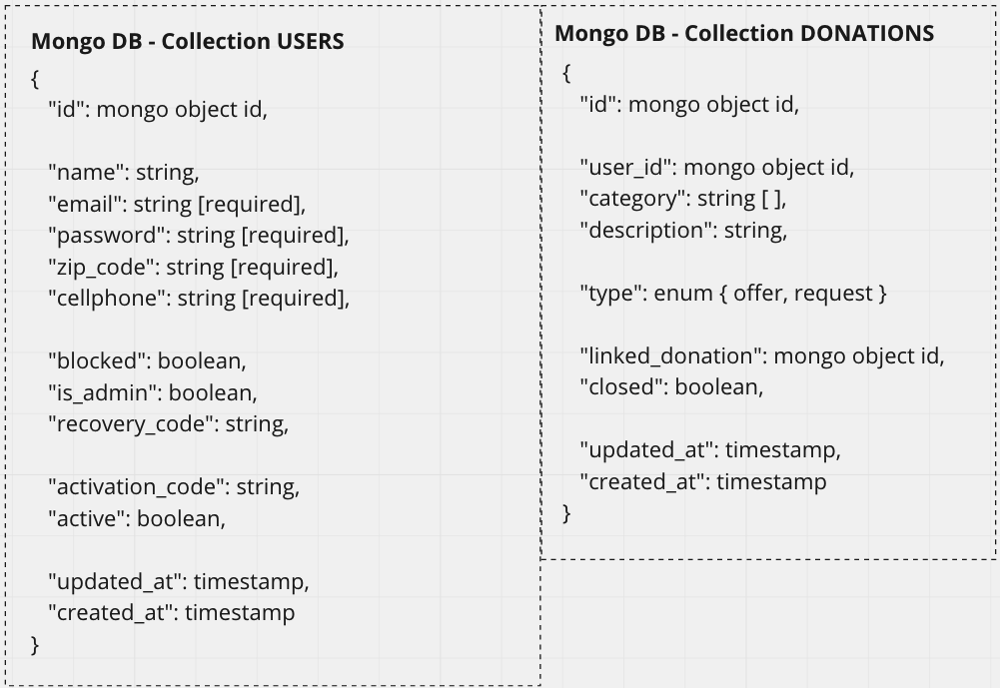
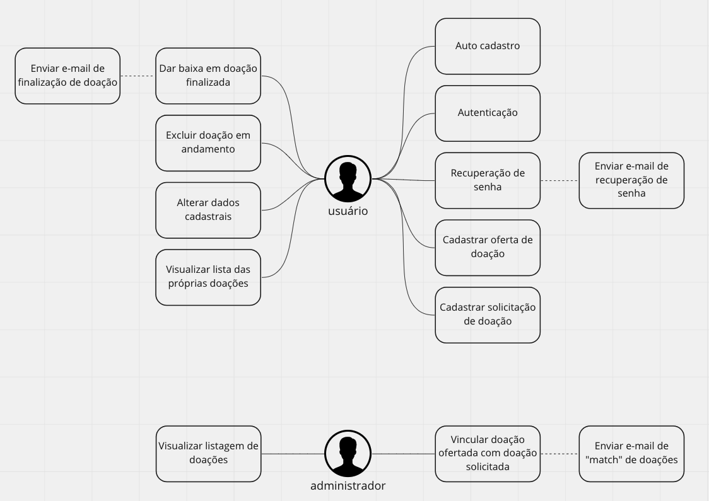

# AJUDE ALGUÉM - Documentações

## Github Organization
https://github.com/ajude-alguem

## Repositórios
Abaixo os repositórios de controle de versão dos projetos do ecossistema Ajude Alguém:

### Micro-serviços Backend
- https://github.com/ajude-alguem/ms-donations
- https://github.com/ajude-alguem/ms-users
- https://github.com/ajude-alguem/ms-mail

### Sistemas Frontend
- https://github.com/ajude-alguem/webapp-backoffice
- https://github.com/ajude-alguem/webapp-public-portal

### Outros repositórios
- https://github.com/ajude-alguem/docs
- https://github.com/ajude-alguem/api-gateway

## Documentações
Abaixo links de referência as documentações do ecossistema:

### ADR - Architecture Decision Records
- [ADR 001 - Linguagem de Backend](adr/adr-001--linguagem-backend.md)
- [ADR 002 - Linguagem e Framework de Frontend](adr/adr-002--linguagem-framework-frontend.md)
- [ADR 003 - Infraestrutura Cloud](adr/adr-003--arquitetura-cloud.md)
- [ADR 004 - Micro-serviços](adr/adr-004--micro-servicos.md)
- [ADR 005 - Banco de dados](adr/adr-005--banco-de-dados.md)

### C4 Model

### Dicionário de dados

### Diagrama de casos de uso
